# @basefold/sketch

Constraint-based 2D sketching in TypeScript.

`@basefold/sketch` lets you define geometry as shapes + constraints, solve it numerically, and export SVG (or a structured graphics object).

## Install

```bash
bun add @basefold/sketch
```

```bash
npm install @basefold/sketch
```

## Quick Start

```ts
import { constraints, Sketch, shapes } from "@basefold/sketch"

const sketch = new Sketch()

sketch.add(new shapes.Rectangle({ name: "R1" }))

sketch.add(
  new constraints.PointToPointDistance({
    point1: "R1.topLeft",
    point2: "R1.topRight",
    distance: 100,
  }),
)

sketch.add(
  new constraints.PointToPointDistance({
    point1: "R1.topLeft",
    point2: "R1.bottomLeft",
    distance: 100,
  }),
)

await sketch.solve()

const svg = sketch.svg({ margin: 50 })
```

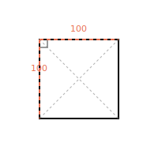

## Shapes

| Shape | Points | Edges | |
|-------|--------|-------|-|
| [Rectangle](#rectangle) | `topLeft` `topRight` `bottomLeft` `bottomRight` | `top` `right` `bottom` `left` | [Details](#rectangle) |
| [Circle](#circle) | `center` `radius` | -- | [Details](#circle) |
| [Arc](#arc) | `center` `start` `end` | `segment` | [Details](#arc) |
| [Line](#line) | `start` `end` | `segment` | [Details](#line) |
| [Oval](#oval) | `center` `radiusX` `radiusY` | -- | [Details](#oval) |
| [RightTriangle](#righttriangle) | `pointAB` `pointAC` `pointBC` | `base` `altitude` `hypotenuse` | [Details](#righttriangle) |
| [Trapezoid](#trapezoid) | `longBase.*` `shortBase.*` `leg1.*` `leg2.*` | `longBase` `shortBase` `leg1` `leg2` | [Details](#trapezoid) |
| [InfiniteLine](#infiniteline) | `start` `end` | `segment` | [Details](#infiniteline) |
| [Axis](#axis) | `start` `end` | `segment` | [Details](#axis) |

## Constraints

| Constraint | Description | |
|------------|-------------|-|
| [FixedPoint](#fixedpoint) | Pin a point to an exact `(x, y)` | [Details](#fixedpoint) |
| [FixedX](#fixedx) | Fix only the x-coordinate of a point | [Details](#fixedx) |
| [FixedY](#fixedy) | Fix only the y-coordinate of a point | [Details](#fixedy) |
| [Coincident](#coincident) | Force two points to the same location | [Details](#coincident) |
| [Horizontal](#horizontal) | Force an edge to be horizontal | [Details](#horizontal) |
| [Vertical](#vertical) | Force an edge to be vertical | [Details](#vertical) |
| [PointToPointDistance](#pointtopointdistance) | Set distance between two points | [Details](#pointtopointdistance) |
| [LineToLineDistance](#linetolinedistance) | Perpendicular distance between two lines | [Details](#linetolinedistance) |
| [PerpendicularDistance](#perpendiculardistance) | Perpendicular distance between two edges | [Details](#perpendiculardistance) |
| [SpaceBetweenEdges](#spacebetweenedges) | Parallel spacing between two edges | [Details](#spacebetweenedges) |
| [Tangent](#tangent) | Make a line tangent to a circle | [Details](#tangent) |

## Points, Edges, and Refs

Constraint arguments use string references like `"ShapeName.pointName"` or `"ShapeName.edgeName"`.

All shapes also expose a typed `refs` object:

```ts
const rect = new shapes.Rectangle({ name: "R1" })
rect.refs.topLeft    // "R1.topLeft"
rect.refs.rightEdge  // "R1.rightEdge"

const tri = new shapes.RightTriangle({ name: "T1", baseLength: 30 })
tri.refs.pointAB     // "T1.pointAB"
tri.refs.hypotenuse  // "T1.hypotenuse"
```

Using `refs` avoids string typos and makes refactoring easier.

---

## Shape Reference

### Rectangle

Points: `topLeft`, `topRight`, `bottomLeft`, `bottomRight`
Edges: `top` / `topEdge`, `right` / `rightEdge`, `bottom` / `bottomEdge`, `left` / `leftEdge`

```ts
const sketch = new Sketch()

const r1 = new shapes.Rectangle({ name: "R1", x: 40, y: 40, width: 120, height: 80 })
const r2 = new shapes.Rectangle({ name: "R2", x: 220, y: 50, width: 100, height: 60 })

sketch.add(r1)
sketch.add(r2)
sketch.add(new constraints.FixedPoint({ point: "R1.topLeft", x: 40, y: 40 }))
sketch.add(new constraints.PointToPointDistance({ point1: "R2.topLeft", point2: "R1.topRight", distance: 40 }))
sketch.add(new constraints.PointToPointDistance({ point1: "R2.bottomLeft", point2: "R1.bottomRight", distance: 40 }))

await sketch.solve()
```

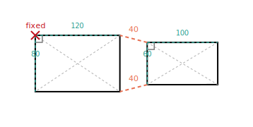

### Circle

Points: `center`, `radius`

```ts
const sketch = new Sketch()

const circle = new shapes.Circle({ name: "C1", radius: 50 })

sketch.add(circle)
sketch.add(new constraints.FixedPoint({ point: "C1.center", x: 0, y: 0 }))
sketch.add(new constraints.FixedY({ point: "C1.radius", y: 0 }))

await sketch.solve()
```

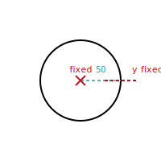

### Arc

Points: `center`, `start`, `end`
Edges: `segment`

Use `Arc` for profile cuts that need curvature (for example, a ball-screw groove before revolve). The arc is defined by center, radius, start angle, end angle, and optional `clockwise` direction.

```ts
const sketch = new Sketch()

const axis = new shapes.Axis({
  name: "Axis",
  origin: { x: 0, y: 20 },
  direction: "y-",
})

const topFlank = new shapes.Line({
  name: "L1",
  x1: 0,
  y1: 20,
  x2: 28,
  y2: 7,
})

const groove = new shapes.Arc({
  name: "A1",
  cx: 24,
  cy: 0,
  radius: 8,
  startAngleDeg: 60,
  endAngleDeg: -60,
  clockwise: true,
})

const bottomFlank = new shapes.Line({
  name: "L2",
  x1: 28,
  y1: -7,
  x2: 0,
  y2: -20,
})

sketch.add(axis)
sketch.add(topFlank)
sketch.add(groove)
sketch.add(bottomFlank)
sketch.add(new constraints.Coincident({ point1: "L1.end", point2: "A1.start" }))
sketch.add(new constraints.Coincident({ point1: "A1.end", point2: "L2.start" }))

await sketch.solve()
```


### Line

Points: `start`, `end`
Edges: `segment`

Supports `length`, `horizontal`, and `vertical` options. Also available as a shorthand factory: `shapes.Line({ horizontal: true, length: 40 })`.

```ts
const sketch = new Sketch()

sketch.add(new shapes.Line({ name: "L3", x1: 0, y1: 0, x2: 20, y2: 0, length: 20 }))

await sketch.solve()
```

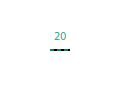

### Oval

Points: `center`, `radiusX`, `radiusY`

```ts
const sketch = new Sketch()

const oval = new shapes.Oval({ name: "O1", rx: 60, ry: 30 })

sketch.add(oval)
sketch.add(new constraints.FixedPoint({ point: "O1.center", x: 0, y: 0 }))

await sketch.solve()
```

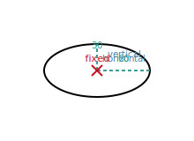

### RightTriangle

Points: `pointAB`, `pointAC`, `pointBC`
Edges: `base` / `a` / `ab`, `altitude` / `b` / `ac`, `hypotenuse` / `c` / `bc`

Does **not** accept `x`/`y` — position it with constraints like `FixedPoint` on `pointAB`.

```ts
const sketch = new Sketch()

const t1 = new shapes.RightTriangle({ name: "T1", baseLength: 30, altitudeLength: 40 })
const t2 = new shapes.RightTriangle({ name: "T2", baseLength: 30, altitudeLength: 40 })

sketch.add(t1)
sketch.add(t2)
sketch.add(new constraints.PerpendicularDistance({ edge1: "T1.base", edge2: "T2.a", distance: 120 }))

await sketch.solve()
```

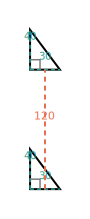

### Trapezoid

Points: `longBase.start`, `longBase.end`, `shortBase.start`, `shortBase.end`, `leg1.start`, `leg1.end`, `leg2.start`, `leg2.end`
Edges: `longBase`, `shortBase`, `leg1`, `leg2`

With `longBaseOrientation` set, you also get directional aliases like `bottommostBase`, `topmostBase`, `leftmostLeg`, `rightmostLeg`, etc.

```ts
const sketch = new Sketch()

const trapezoid = new shapes.Trapezoid({
  name: "T1",
  longBaseLength: 90,
  shortBaseLength: 40,
  hasEqualLengthLegs: true,
})

sketch.add(trapezoid)
sketch.add(new constraints.FixedPoint({ point: "T1.longBase.start", x: 20, y: 40 }))

await sketch.solve()
```

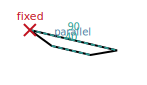

### InfiniteLine

Points: `start`, `end`
Edges: `segment`

Direction can be a cardinal shorthand (`"x+"`, `"x-"`, `"y+"`, `"y-"`) or a vector `{ x, y }`.

```ts
const sketch = new Sketch()

sketch.add(new shapes.InfiniteLine({ name: "Y2", origin: { x: 0, y: 2 }, direction: "x+" }))
sketch.add(new shapes.InfiniteLine({ name: "D1", origin: { x: -4, y: -1 }, direction: { x: 2, y: 3 } }))

await sketch.solve()
```

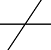

### Axis

Extends [InfiniteLine](#infiniteline). Same API — use for semantic clarity when representing coordinate axes.

```ts
const sketch = new Sketch()

sketch.add(new shapes.Axis({ name: "X", direction: "x+" }))
sketch.add(new shapes.Axis({ name: "A1", origin: { x: 3, y: 1 }, direction: "y-" }))

await sketch.solve()
```

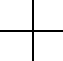

---

## Constraint Reference

### FixedPoint

Pin a point to an exact `(x, y)` coordinate.

```ts
sketch.add(new constraints.FixedPoint({ point: "C1.center", x: 0, y: 0 }))
```


### FixedX

Fix only the x-coordinate of a point. The y-coordinate remains free.

```ts
sketch.add(new constraints.FixedX({ point: "L1.start", x: 50 }))
```

### FixedY

Fix only the y-coordinate of a point. The x-coordinate remains free.

```ts
sketch.add(new constraints.FixedY({ point: "L1.start", y: 50 }))
```

### Coincident

Force two points to occupy the same location. Useful for connecting shapes end-to-end.

```ts
const sketch = new Sketch()

const base = new shapes.Line({ name: "L1", x1: 0, y1: 0, x2: 100, y2: 0, length: 100 })
const linked = new shapes.Line({ name: "L2", x1: 140, y1: 60, x2: 220, y2: 60, length: 80 })

sketch.add(base)
sketch.add(linked)
sketch.add(new constraints.Coincident({ point1: "L1.end", point2: "L2.start" }))
sketch.add(new constraints.PointToPointDistance({ point1: "L1.start", point2: "L2.end", distance: 120 }))

await sketch.solve()
```

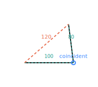

### Horizontal

Force an edge to be perfectly horizontal (both endpoints share the same y-coordinate).

### Vertical

Force an edge to be perfectly vertical (both endpoints share the same x-coordinate).

```ts
const sketch = new Sketch()

sketch.add(new shapes.Line({ name: "H1", x1: 0, y1: 0, x2: 30, y2: 0, length: 30 }))
sketch.add(new shapes.Line({ name: "V1", x1: 80, y1: 0, x2: 80, y2: 20, length: 20 }))

sketch.add(new constraints.Horizontal({ line: "H1" }))
sketch.add(new constraints.Vertical({ line: "V1" }))

await sketch.solve()
```

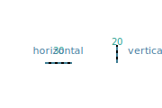

### PointToPointDistance

Maintain a specific distance between two points.

```ts
sketch.add(
  new constraints.PointToPointDistance({
    point1: "R1.topLeft",
    point2: "R1.topRight",
    distance: 100,
  }),
)
```


### LineToLineDistance

Perpendicular distance between the midpoints of two line segments.

```ts
const sketch = new Sketch()

const trapezoid = new shapes.Trapezoid({
  name: "T1",
  longBaseLength: 100,
  shortBaseLength: 60,
  longBaseOrientation: "left",
})

sketch.add(trapezoid)
sketch.add(new constraints.LineToLineDistance({ line1: "T1.longBase", line2: "T1.shortBase", distance: 50 }))
sketch.add(new constraints.Vertical({ line: "T1.longBase" }))

await sketch.solve()
```

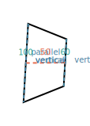

### PerpendicularDistance

Perpendicular distance between two edges. Similar to [LineToLineDistance](#linetolinedistance) but uses edge references.

```ts
sketch.add(
  new constraints.PerpendicularDistance({
    edge1: "T1.base",
    edge2: "T2.a",
    distance: 120,
  }),
)
```


### SpaceBetweenEdges

Enforce parallel spacing between two edges. Unlike [PerpendicularDistance](#perpendiculardistance), this guarantees the edges don't overlap — the gap is measured as clear space between them.

```ts
const sketch = new Sketch()

sketch.add(new shapes.Line({ name: "L1", x1: 0, y1: 0, x2: 100, y2: 0 }))
sketch.add(new shapes.Line({ name: "L2", x1: 0, y1: 20, x2: 100, y2: 20 }))

sketch.add(
  new constraints.SpaceBetweenEdges({
    edge1: "L1.segment",
    edge2: "L2.segment",
    distance: 50,
  }),
)

await sketch.solve()
```

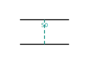

### Tangent

Make a line tangent to a circle (the line just touches the circle at one point).

```ts
const sketch = new Sketch()

const circle = new shapes.Circle({ name: "C1", radius: 40 })
const line = new shapes.Line({ name: "L1" })

sketch.add(circle)
sketch.add(line)

sketch.add(new constraints.FixedPoint({ point: "C1.center", x: 0, y: 0 }))
sketch.add(new constraints.FixedY({ point: "L1.start", y: 50 }))
sketch.add(new constraints.PointToPointDistance({ point1: "L1.start", point2: "L1.end", distance: 160 }))
sketch.add(new constraints.PointToPointDistance({ point1: "C1.center", point2: "L1.start", distance: 50 }))
sketch.add(new constraints.Tangent({ line: "L1", circle: "C1" }))

await sketch.solve()
```

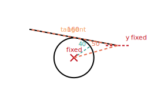

---

## Rendering Output

### SVG output

`sketch.svg()` returns an SVG string with shapes and visualized constraints.

```ts
const svg = sketch.svg({ margin: 40, strokeWidth: 2 })
```

### Graphics object output

`sketch.graphicsObject()` returns a structured object suitable for custom renderers or debug tooling.

```ts
const graphics = sketch.graphicsObject()
```

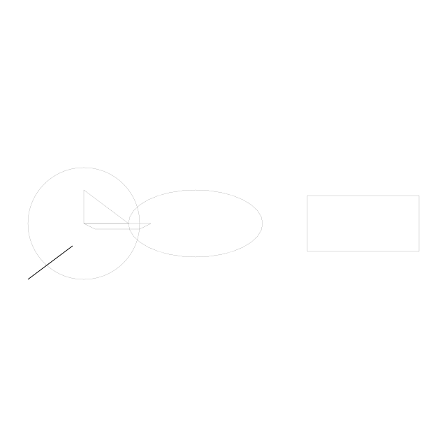

## Notes

- `RightTriangle` does not accept `x`/`y`; position it with constraints such as `FixedPoint` on `pointAB`.
- Most shape options are optional and act as initial guesses when not fixed by internal/user constraints.
- For deterministic output, keep at least one positional anchor (`FixedPoint`, `FixedX`, or `FixedY`).
