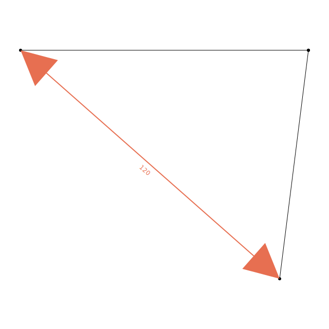

# @basefold/sketch

Constraint-based 2D sketching in TypeScript.

`@basefold/sketch` lets you define geometry as shapes + constraints, solve it numerically, and export SVG (or a structured graphics object).

## Install

```bash
bun add @basefold/sketch
```

```bash
npm install @basefold/sketch
```

## Quick Start

```ts
import { constraints, Sketch, shapes } from "@basefold/sketch"

const sketch = new Sketch()

sketch.add(new shapes.Rectangle({ name: "R1" }))

sketch.add(
  new constraints.PointToPointDistance({
    point1: "R1.topLeft",
    point2: "R1.topRight",
    distance: 100,
  }),
)

sketch.add(
  new constraints.PointToPointDistance({
    point1: "R1.topLeft",
    point2: "R1.bottomLeft",
    distance: 100,
  }),
)

await sketch.solve()

const svg = sketch.svg({ margin: 50 })
```


Snapshot source: `tests/readme-drawing01.test.ts`

## Core Workflow

1. Create a `Sketch`.
2. Add one or more shapes.
3. Add constraints between shape points/edges.
4. Call `await sketch.solve()`.
5. Export with `sketch.svg()` or `sketch.graphicsObject()`.

## Points, Edges, and Refs

Constraint arguments use string references like `"ShapeName.pointName"` or `"ShapeName.edgeName"`.

All shapes also expose a typed `refs` object:

- `triangle.refs.pointAB` -> `"T1.pointAB"`
- `rectangle.refs.rightEdge` -> `"R1.rightEdge"`

Using `refs` avoids string typos and makes refactoring easier.

## Usage Examples

### 1) Circle + Tangent Line

```ts
import { constraints, Sketch, shapes } from "@basefold/sketch"

const sketch = new Sketch()

const circle = new shapes.Circle({
  name: "C1",
  cx: 0,
  cy: 0,
  radius: 40,
})

const line = new shapes.Line({ name: "L1" })

sketch.add(circle)
sketch.add(line)

sketch.add(new constraints.FixedPoint({ point: "C1.center", x: 0, y: 0 }))
sketch.add(new constraints.FixedY({ point: "L1.start", y: 50 }))
sketch.add(
  new constraints.PointToPointDistance({
    point1: "L1.start",
    point2: "L1.end",
    distance: 160,
  }),
)
sketch.add(
  new constraints.PointToPointDistance({
    point1: "C1.center",
    point2: "L1.start",
    distance: 50,
  }),
)
sketch.add(new constraints.Tangent({ line: "L1", circle: "C1" }))

await sketch.solve()
```


Snapshot source: `tests/tangent01.test.ts`

### 2) Wiring Shapes with Coincident + Distance

```ts
import { constraints, Sketch, shapes } from "@basefold/sketch"

const sketch = new Sketch()

const base = new shapes.Line({
  name: "L1",
  x1: 0,
  y1: 0,
  x2: 100,
  y2: 0,
  length: 100,
})

const linked = new shapes.Line({
  name: "L2",
  x1: 140,
  y1: 60,
  x2: 220,
  y2: 60,
  length: 80,
})

sketch.add(base)
sketch.add(linked)
sketch.add(new constraints.Coincident({ point1: "L1.end", point2: "L2.start" }))
sketch.add(
  new constraints.PointToPointDistance({
    point1: "L1.start",
    point2: "L2.end",
    distance: 120,
  }),
)

await sketch.solve()
```


Constraint graphics from `sketch.graphicsObject()`:



Snapshot source: `tests/relative-lines01.test.ts`

### 3) Spacing Between Two Edges

```ts
import { constraints, Sketch, shapes } from "@basefold/sketch"

const sketch = new Sketch()

sketch.add(new shapes.Line({ name: "L1", x1: 0, y1: 0, x2: 100, y2: 0 }))
sketch.add(new shapes.Line({ name: "L2", x1: 0, y1: 20, x2: 100, y2: 20 }))

sketch.add(
  new constraints.SpaceBetweenEdges({
    edge1: "L1.segment",
    edge2: "L2.segment",
    distance: 50,
  }),
)

await sketch.solve()
```


Snapshot source: `tests/space-between-edges01.test.ts`

### 4) RightTriangle Edge Aliases in PerpendicularDistance

`RightTriangle` edge selectors are `base`, `altitude`, `hypotenuse` and aliases `a`, `b`, `c` (`ab`, `ac`, `bc` are also supported).

```ts
import { constraints, Sketch, shapes } from "@basefold/sketch"

const sketch = new Sketch()

const t1 = new shapes.RightTriangle({
  name: "T1",
  baseLength: 30,
  altitudeLength: 40,
})
const t2 = new shapes.RightTriangle({
  name: "T2",
  baseLength: 30,
  altitudeLength: 40,
})

sketch.add(t1)
sketch.add(t2)

sketch.add(
  new constraints.PerpendicularDistance({
    edge1: "T1.base",
    edge2: "T2.a",
    distance: 120,
  }),
)

await sketch.solve()
```


Snapshot source: `tests/right-triangle03.test.ts`

### 5) Trapezoid with Equal Legs

```ts
import { constraints, Sketch, shapes } from "@basefold/sketch"

const sketch = new Sketch()

const trapezoid = new shapes.Trapezoid({
  name: "T1",
  longBaseLength: 90,
  shortBaseLength: 40,
  hasEqualLengthLegs: true,
})

sketch.add(trapezoid)
sketch.add(
  new constraints.FixedPoint({
    point: "T1.longBase.start",
    x: 20,
    y: 40,
  }),
)

await sketch.solve()
```


Snapshot source: `tests/trapezoid01.test.ts`

## Rendering Output

### SVG output

`sketch.svg()` returns an SVG string that includes shapes and visualized constraints.

```ts
const svg = sketch.svg({ margin: 40, strokeWidth: 2 })
```

### Graphics object output

`sketch.graphicsObject()` returns a structured object suitable for custom renderers or debug tooling.

```ts
const graphics = sketch.graphicsObject()
```


Snapshot source: `tests/graphics-object01.test.ts`

## Available Shapes

- `Axis`
- `Circle`
- `InfiniteLine`
- `Line` (class + shorthand factory)
- `Oval`
- `Rectangle`
- `RightTriangle`
- `Trapezoid`

## Available Constraints

- `Coincident`
- `FixedPoint`
- `FixedX`
- `FixedY`
- `Horizontal`
- `LineToLineDistance`
- `PerpendicularDistance`
- `PointToPointDistance`
- `SpaceBetweenEdges`
- `Tangent`
- `Vertical`

## Notes

- `RightTriangle` does not accept `x`/`y`; position it with constraints such as `FixedPoint` on `pointAB`.
- Most shape options are optional and act as initial guesses when not fixed by internal/user constraints.
- For deterministic docs/examples, keep at least one positional anchor (`FixedPoint`, `FixedX`, or `FixedY`) when practical.
